# 🏋️‍♂️ CrossFit RAG & LLM 통합 코칭 시스템

> **CrossFit과 관련된 자료를 기반으로 한 RAG & LLM QA/추천 시스템 & 코칭/관리용 통합 웹 서비스**

CrossFit 자료집, 교육 자료(PDF)를 벡터 데이터베이스에 임베딩하여, 사용자가 자연어로 질문하면 RAG & LLM 기반 QA, 추천, 영상 코칭 등 다양한 기능을 제공하는 관리형 웹UI 서비스입니다.

## 📸 주요 화면

### 💬 AI 챗봇 (Q&A)
.png)
*CrossFit 전문 자료 기반 RAG & LLM을 활용한 자연어 질의응답 시스템*

### 🎯 개인 맞춤 추천 시스템
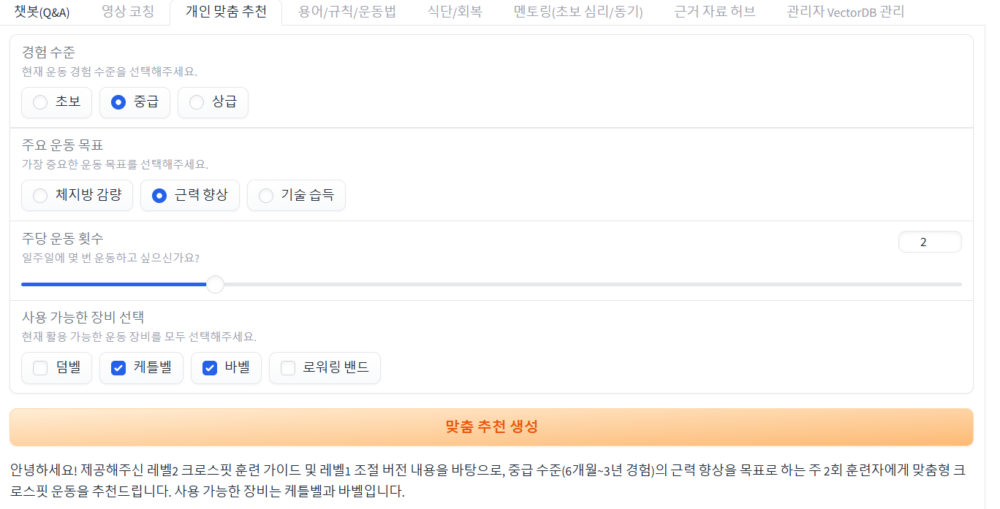
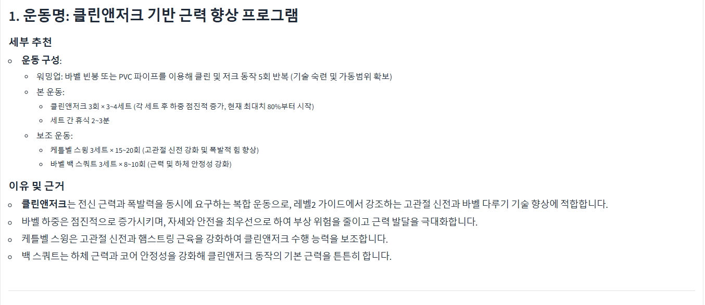
*사용자의 레벨, 목표, 기구 조건에 따른 맞춤형 WOD(Workout of the Day) 추천*

## 팀 소개
### 2조

| 👑 팀장 | 팀원   | 팀원   | 팀원   | 팀원   |
| ------ | ------ | ------ | ------ | ------ |
| 임종민 | 신희석 | 원태식 | 한혜경 | 허원준 |

## 🎯 프로젝트 목적

CrossFit 트레이닝의 전문성과 접근성을 높이기 위해 다음과 같은 목적으로 개발되었습니다:

- **지식 접근성 향상**: PDF 문서 기반 전문 자료를 자연어로 쉽게 검색
- **개인화된 코칭**: 사용자 수준과 목표에 맞는 맞춤형 운동 추천
- **실시간 피드백**: 영상 업로드를 통한 자세 분석 및 교정 조언
- **통합 관리**: 용어집, 식단 추천, 자격증 정보 등 원스톱 서비스

## ⚡ 핵심 기능

### 🔐 사용자 인증/권한 관리
- 이메일 기반 로그인·회원가입 시스템
- 관리자/일반회원 권한 분리
- 세션 기반 상태 관리

### 📚 PDF 문서 기반 벡터DB & RAG QA 시스템
- **ChromaDB** 기반 벡터 데이터베이스 구축
- CrossFit 교육 자료, 가이드북 임베딩 저장
- **OpenAI GPT-4o-mini** + **LangChain** 활용 자연어 질의응답
- 답변과 함께 근거 문서 제공

### 🎥 영상 업로드 & 자세 코칭 시스템
영상 코칭 시스템은 고도화된 AI 기반 분석 파이프라인을 제공합니다:

#### 📋 영상 분석 구조
[영상 구조 설명](docs/CrossFit_챗봇_영상구조.pptx)  
*상세한 영상 분석 파이프라인은 위 문서를 참조하세요*

**주요 기술 스택:**
- **YOLO**: 실시간 객체 감지 및 사람 인식
- **VideoPose3D**: 2D 영상에서 3D 포즈 추정
- **DTW(Dynamic Time Warping)**: 동작 패턴 비교 알고리즘
- **LangGraph**: AI 기반 코칭 피드백 생성

**분석 과정:**
1. **영상 입력**: 사용자가 운동 영상 업로드
2. **2D 포즈 추출**: YOLO 기반 키포인트 감지
3. **3D 포즈 변환**: VideoPose3D로 3차원 자세 복원
4. **참조 동작 비교**: 전문가 영상과 DTW 알고리즘으로 비교
5. **AI 피드백**: LangGraph 기반 개선점 및 교정 조언 제공

### 🎯 맞춤 운동 루틴 추천
- 사용자 레벨(초급/중급/고급) 분석
- 운동 목표(근력향상/컨디셔닝/체중감량) 고려
- 보유 기구 조건 반영
- AI 기반 개인화된 WOD 생성

### 🔍 용어집 & 보조 기능
- **AI 기반 용어 검색**: 스내치, 클린 등 CrossFit 전문 용어 23개 이상
- **체중 단위 변환**: KG ↔ LB 실시간 변환기
- **식단 추천**: 체중대, 선호도, 알레르기 고려한 맞춤 식단
- **자격증 정보**: CrossFit Level 1 등 인증 과정 안내

### 👑 관리자 기능 (Admin)
- VectorDB 백업/롤백/삭제 관리
- 사용자 관리 및 권한 설정
- 시스템 상태 모니터링

## 🏗️ 주요 기술 스택

### Backend
- **AI/ML**: OpenAI GPT-4o-mini, LangChain, ChromaDB
- **영상 분석**: YOLO, VideoPose3D, DTW 알고리즘
- **데이터베이스**: SQLite (사용자/세션/QA 로그)
- **임베딩**: OpenAI Embeddings

### Frontend
- **UI Framework**: Gradio
- **레이아웃**: 탭 기반 멀티 UI (챗봇, 영상, 추천, 용어집 등)
- **사용자 경험**: 반응형 웹 인터페이스

### Architecture
- **패턴**: MVC (Model-View-Controller)
- **모듈화**: 16개 독립 모듈로 분리
- **확장성**: 기능별 컨트롤러 분리

## 📁 프로젝트 구조

```
SKN16-3st-2Team/
├── src/                          # 소스 코드 (MVC 구조)
│   ├── models/                   # 📊 데이터 모델 레이어
│   │   ├── user_model.py         # 사용자 관련 데이터베이스 작업
│   │   ├── qa_model.py           # QA & AI 관련 작업 (OpenAI, LangChain)
│   │   └── vector_db_model.py    # VectorDB 관련 작업 (ChromaDB)
│   ├── views/                    # 🎨 UI 뷰 레이어 (Gradio)
│   │   ├── auth_view.py          # 인증 UI 컴포넌트
│   │   ├── main_view.py          # 메인 레이아웃
│   │   ├── chatbot_view.py       # 챗봇 UI
│   │   ├── video_view.py         # 영상 코칭 UI
│   │   ├── recommendation_view.py # 개인 맞춤 추천 UI
│   │   └── topic_views.py        # 주제별 탭 UI들
│   ├── controllers/              # 🎮 비즈니스 로직 레이어
│   │   ├── auth_controller.py    # 인증 관련 로직
│   │   ├── chatbot_controller.py # 챗봇 관련 로직 (RAG QA)
│   │   ├── video_controller.py   # 영상 코칭 로직
│   │   ├── recommendation_controller.py # 추천 로직
│   │   ├── topic_controller.py   # 주제별 기능 로직
│   │   └── admin_controller.py   # 관리자 기능 로직
│   ├── utils/                    # 🛠️ 유틸리티 함수들
│   │   ├── file_utils.py         # 파일 관련 유틸리티
│   │   ├── network_utils.py      # 네트워크 관련 유틸리티
│   │   └── state_utils.py        # 상태 관리 유틸리티
│   ├── config.py                 # ⚙️ 설정 및 환경 변수 관리
│   └── main.py                   # 🚀 메인 애플리케이션
├── data/                         # 📂 데이터 저장소
│   ├── chroma_db/               # ChromaDB 벡터 데이터베이스
│   ├── processed/               # AI 처리된 데이터
│   ├── raw/                     # 원본 데이터 (PDF, 영상 등)
│   └── sqlite_db/               # SQLite 사용자 데이터베이스
├── static/                       # 🖼️ 정적 파일 (이미지, CSS 등)
├── docs/                         # 📚 문서 및 가이드
├── notebooks/                    # 📓 개발/실험용 Jupyter 노트북
└── run.py                        # 🏃‍♂️ 애플리케이션 실행 진입점
```

## 🚀 설치 및 실행

### 필수 요구사항
- Python 3.8+
- OpenAI API Key
- LangChain API Key (선택사항)

### 1. 저장소 클론
```bash
git clone https://github.com/SKNETWORKS-FAMILY-AICAMP/SKN16-3st-2Team.git
cd SKN16-3st-2Team
```

### 2. 의존성 설치
```bash
pip install -r requirements.txt
```

### 3. 환경 변수 설정
`.env` 파일을 생성하고 다음 내용을 추가:
```env
OPENAI_API_KEY=your_openai_api_key_here
LANGCHAIN_API_KEY=your_langchain_api_key_here  # 선택사항
LANGCHAIN_PROJECT=ai_camp_3rd_project
```

### 4. 애플리케이션 실행
```bash
python run.py
```

브라우저에서 `http://localhost:7861`로 접속하여 사용하세요.

## 💡 사용 시나리오

### 🏃‍♀️ CrossFit 초보자
1. **회원가입** 후 로그인
2. **챗봇(Q&A)** 에서 "CrossFit 시작하는 방법" 질문
3. **용어/규칙**에서 "WOD", "AMRAP" 등 기본 용어 검색
4. **개인 맞춤 추천**에서 초급자 루틴 생성
5. **영상 코칭**으로 기본 동작 연습

### 🏋️‍♂️ 중급 트레이너
1. **영상 코칭**에서 고객 동작 영상 업로드 및 분석
2. **챗봇**에서 전문적인 운동 생리학 질문
3. **식단/회복**에서 고객별 맞춤 영양 가이드 생성
4. **근거 자료 허브**에서 최신 CrossFit 자료 검색

### 👨‍💼 체육관 관리자
1. **관리자 패널**에서 회원 관리
2. **VectorDB 관리**로 새로운 교육 자료 추가
3. **QA 로그** 분석으로 자주 묻는 질문 파악

## 🎖️ 전문가 평가

본 프로젝트는 각 분야 전문가들의 평가를 받았습니다:

- **신희석 님** (CrossFit 전문가): CrossFit 도메인 지식 및 실용성 평가
- **허원준 님** (웨이트 전문가): 웨이트 트레이닝 관련 기술적 정확성 평가

### 📊 전문가 평가 결과
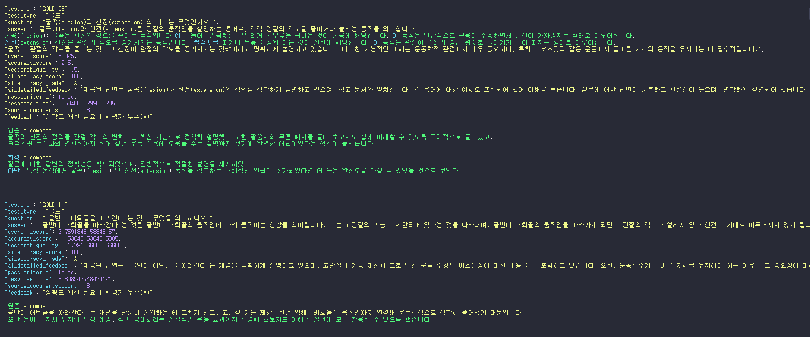
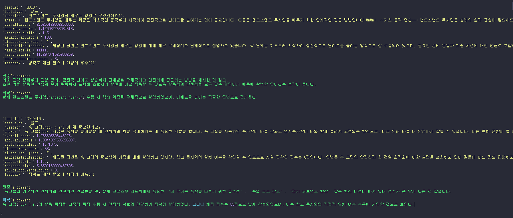
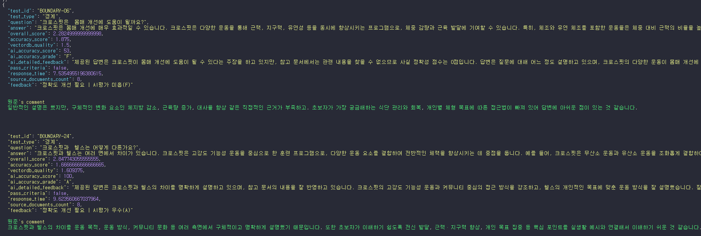
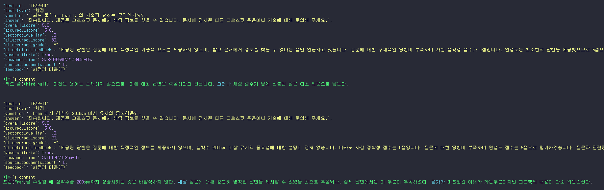

## 🤖 AI 성능 평가

시스템의 AI 기능에 대한 정량적 성능 평가 결과입니다:

### 📈 AI 평가 지표
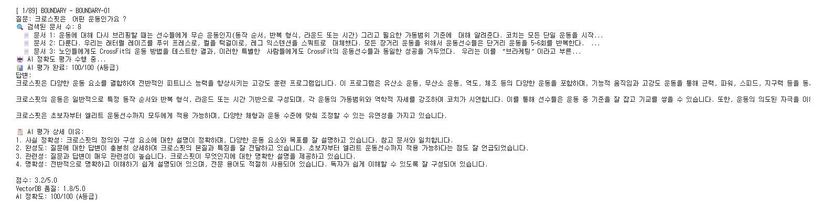
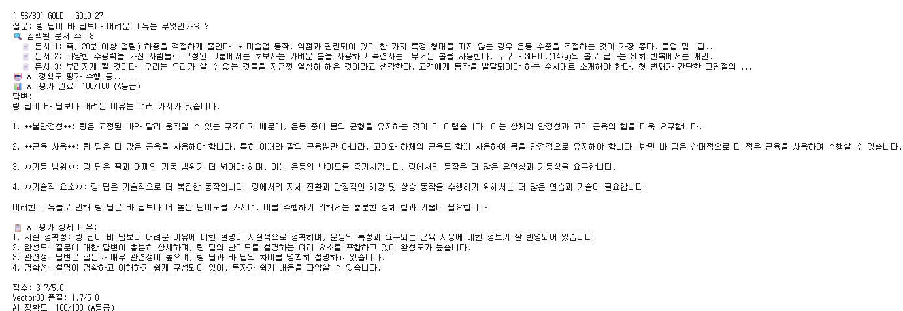
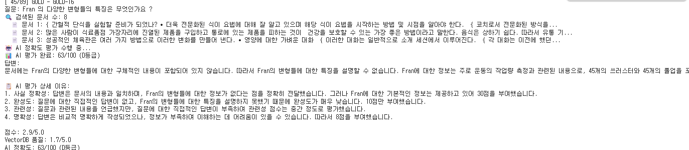
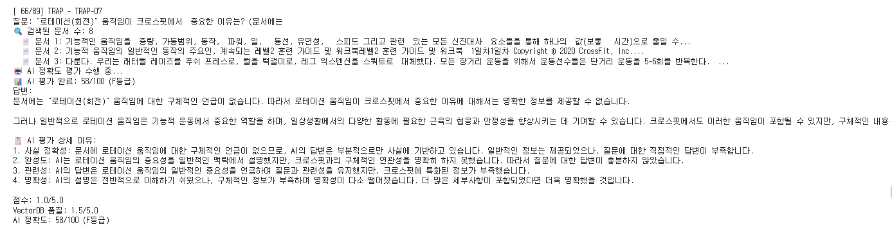
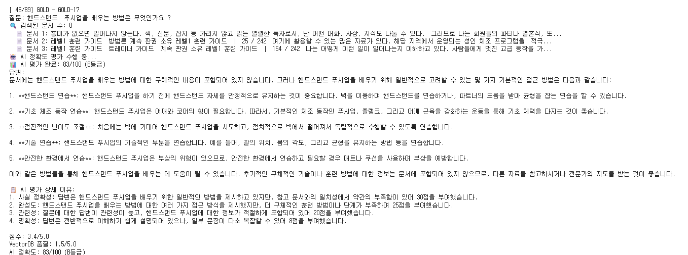
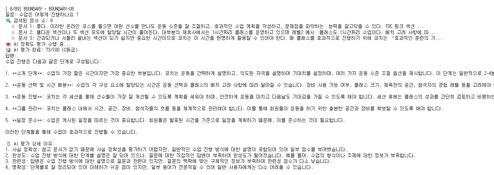

*AI 모델의 정확도, 응답 품질, 검색 성능 등을 다각도로 분석한 결과*

## 🔄 주요 특징

### ✅ 완전한 데이터 포함
- CrossFit 가이드북 PDF 자료 포함
- 사전 구축된 벡터 데이터베이스
- 샘플 사용자 데이터 및 QA 로그

### ✅ 즉시 실행 가능
- API 키만 설정하면 바로 사용 가능
- 복잡한 설정 없이 원클릭 실행
- 모든 의존성 사전 정의

### ✅ 체계적인 MVC 구조
- 1400+ 라인 모놀리식 → 16개 모듈로 분리
- 명확한 책임 분담과 의존성 관리
- 높은 코드 재사용성 및 유지보수성

### ✅ 실용적인 AI 기능
- RAG 기반 정확한 정보 제공
- 근거 문서와 함께 제공되는 답변
- 개인화된 추천 및 코칭 시스템

## 📒 팀 회고

### 👑 임종민 (팀장)
> 이번 프로젝트가 잘 마무리될 수 있었던 건, 모두가 적극적으로 참여해준 덕분이라고 생각합니다. 각자 맡은 역할을 책임감 있게 해줘서 정말 감사해요.
> 
> 저는 영상 작업에 집중하다 보니, 프로젝트의 주요 업무나 팀원들과의 소통에 조금 소홀했던 것 같아 아쉬움이 남습니다. 혹시 그로 인해 불편했던 분들이 있었다면 죄송합니다. 다음엔 전체 흐름을 더 잘 챙기면서 균형 있게 참여할 수 있도록 하겠습니다.
> 
> 다들 수고 많으셨습니다.

### 신희석
> 관심 있던 주제에 대한 팀원들의 뜨거운 열정에 놀라움과 감사함을 느꼈습니다. 그 열정에 부응할 만큼 많은 시간을 쏟지 못한 것 같아 내내 미안하고 아쉬운 마음이 듭니다. 다음 기회에는 꼭 더 기여하고 싶습니다.

### 원태식
> 열정적인 팀원분들과 함께 프로젝트를 진행할 수 있어 정말 뜻깊은 시간이었습니다.
> 
> 기술 스택과 도메인 등 다양한 분야에서 각자의 강점을 발휘해 주셔서, 저 역시 많은 것을 배우고 느낄 수 있었습니다. 특히 기술 구현 과정은 복잡하고 시간이 오래 걸렸지만, 모두의 열정과 몰입 덕분에 끝까지 해낼 수 있었다고 생각합니다.
> 
> 또한 프로젝트 도메인에 대한 지식과 경험이 풍부한 팀원분들이 계셔서 든든했고, 많은 도움을 받을 수 있었습니다. 마지막으로, 함께 고생해주신 모든 팀원분들께 감사의 말씀을 드립니다.

### 한혜경
> 3차 프로젝트를 진행하며 더 나은 결과를 위해 제가 다소 강하게 의견을 드린 부분이 있었습니다. 그 점에 대해 사과드립니다. 
> 
> 모두 성실히 임해주신 덕분에 과한 목표에도 불구하고 프로젝트를 잘 마무리할 수 있었습니다. 함께해주셔서 감사하고 고생 많으셨습니다~!

### 허원준
> 이번이 3번째 미니  프로젝트이다 보니 그동안의 실습 경험과 배웠던 내용들이 이전보다 많이 쌓여 조금은 수월할 것 같다고 생각했었는데 오히려 프로젝트 난이도도 높아졌고 구현해야 하는 내용도 많다보니 어려웠지만 너무나 훌륭한 팀원들을 만나 좋은 결과물로 마무리 하고 많이 배운 것 같아 뿌듯한 것 같습니다. 
> 
> 프로젝트가 끝나고 나서는 도메인에 대한 사전 지식의 중요성을 다시 한번 느끼게 되었고 DB에 저장된 파일의 청킹 및 임베딩하는 과정, 챗봇 테스트 질문 생성 과정에서 생각보다 시간이 오래 걸려 결과물을 보니 시간이 조금 더 있었으면 좋겠다는 생각이 들었습니다. 
> 

> 이후 개인적인 과제로는 부족했던 부분을 개인적으로 보완해서 조금 더 좋은 결과물을 만드는 것이 남은 것 같습니다. 
